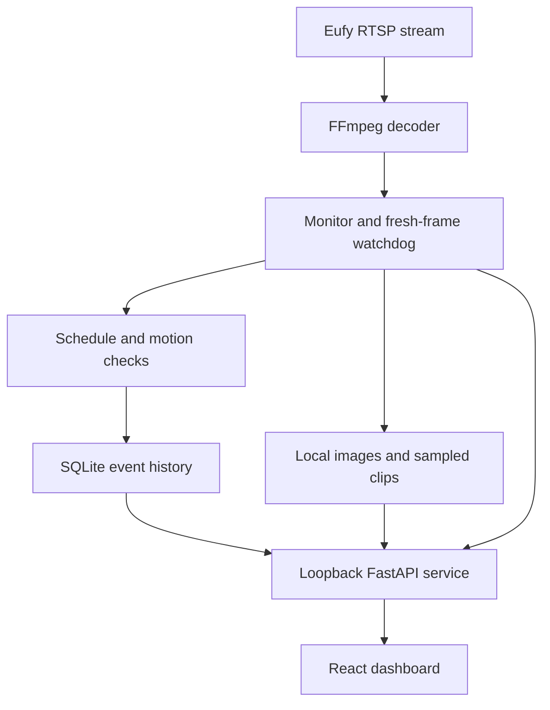

# Architecture

## Components and data flow

- `capture.py`: launches one FFmpeg decoder with TCP transport, a ten-second RTSP socket
  timeout and a twelve-second read watchdog. Reads complete 640×360 RGB frames at 2 fps.
  Decoder stderr is discarded to prevent camera URL/credential leaks. Termination has a
  bounded wait followed by kill. Clip encoding uses a separate bounded subprocess.
- `monitor.py`: coordinates frame capture, reconnect backoff (2–30 seconds), freshness,
  the outage watchdog, daily comparisons, rolling JPEG pre-roll, event storage, and retention.
- `detection.py`: pure observation state machine with injected time/frame inputs for tests.
  Measures equal-weight RGB brightness and mean absolute pixel difference within a surface
  region. Rejects motion evidence after gaps and large exposure changes. These values are
  image metrics, not physical light/flow readings.
- `storage.py`: SQLite WAL events, metrics every thirty seconds, snapshots, review state,
  and retention cleanup. Media is addressed by generated UUID filenames.
- `config.py`: validated settings, timezone/schedule/region constraints, private atomic
  settings writes, public settings view excluding credentials.
- `app.py`: local API, host/origin protection, secret-safe validation errors, freshness
  gating, media filename allowlist, lifespan startup/shutdown and process lock.
- `frontend/`: React/Vite dashboard. Built assets are included for Python-only installation.

## State and timing decisions

Camera state: not configured → connecting → connected; read failure → reconnecting;
missing frames past the outage threshold → offline. Only fresh frames count as evidence.
The UI also hides the live view if it loses contact with the backend.

Each visual rule requires its condition to remain true for the configured duration
(90 seconds by default), emits once, and rearms after the condition clears. Maintenance
pauses visual rules and scheduled photos. It does not hide missing video. Calibration
requires uninterrupted stable daytime footage, and cannot accept a near-static region.

Settings changes/restart discard calibration. A reconnect clears temporal comparisons;
the surface baseline remains for a reconnect to the same configured view. Moving a camera
requires manual recalibration. Full occlusion and subtle camera movement are not classified
separately in v0.1 and can create misleading visual metrics.

Event clips contain the preceding 2–15 seconds when enough frames are buffered. Encoding
concurrency is capped at two. An image remains available if encoding fails. There is no
post-event recording, continuous archive, audio recording, or browser-native RTSP player.

The runtime makes no Internet calls. Local alerts are written to the timeline only.
Future notification delivery must be isolated from capture so network delays cannot stall
the frame loop.

## API

| Method | Path | Purpose |
| --- | --- | --- |
| GET | `/api/status` | Public settings, freshness, metrics, events, comparisons |
| GET | `/api/frame` | Current JPEG; 503 when stale/missing |
| PUT | `/api/settings` | Save settings; blank URL preserves credentials; `disconnect:true` clears them |
| POST | `/api/pause`, `/api/resume` | Maintenance controls |
| POST | `/api/calibrate` | Start manual daytime surface reference |
| POST | `/api/snapshots` | Save a fresh manual comparison |
| POST | `/api/events/{id}/acknowledge` | Mark an event reviewed |
| GET | `/media/{uuid.jpg or uuid.mp4}` | View local evidence |

Mutations require `X-Reef-Watch: 1` and, when present, a matching Origin. The service
accepts only localhost hostnames and is bound to loopback. This is a local trust boundary,
not a substitute for authentication for remote use. Do not use multiple server workers.

## Persistence and recovery

The data directory is independent of the checkout. Demo data is separate. Event IDs and
media paths are generated internally. Retention runs hourly and at startup; unreferenced
owned media is eventually removed after the retention age. The SQLite file can retain
allocated disk space for reuse after deletion; no recurring VACUUM is performed.

The launchd service suppresses console output; troubleshoot in the foreground after
uninstalling/stopping the service. Camera errors shown to the user are intentionally
generic. Disk failure, lack of space, corrupted storage, and sudden power loss remain
operational limitations; this prototype is not a life-support controller.
